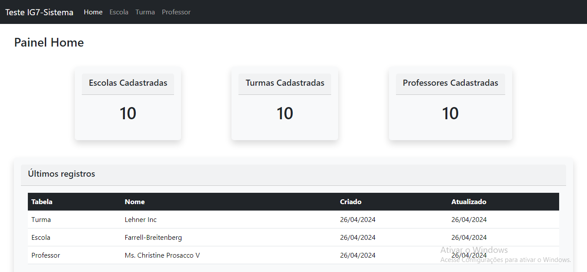
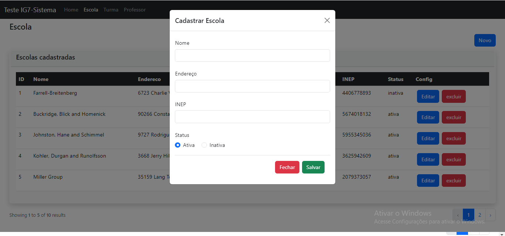
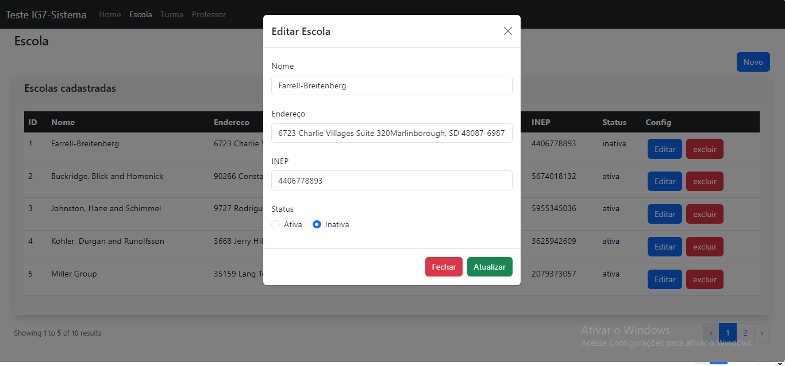
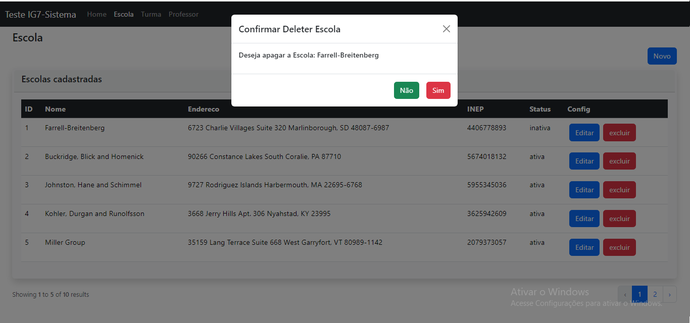
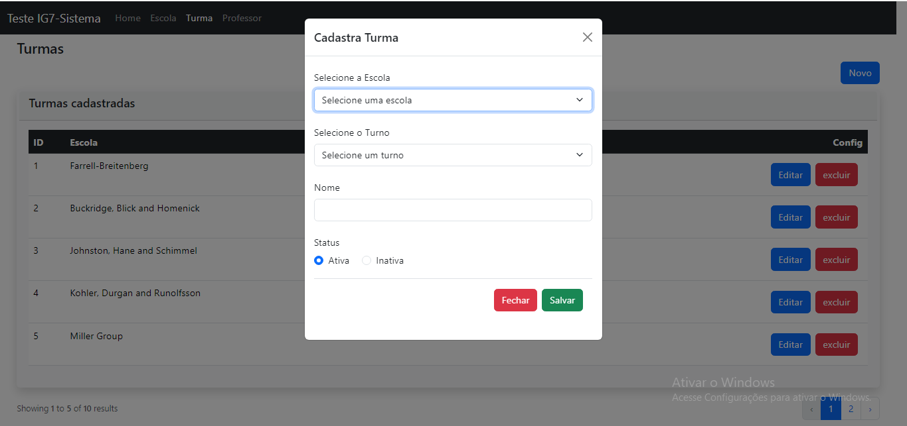
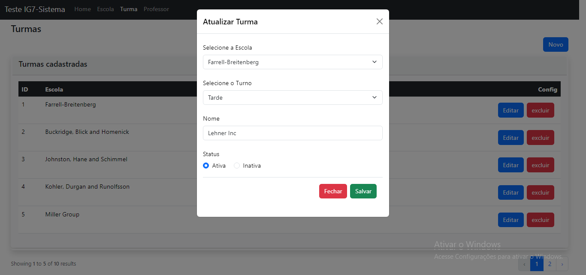
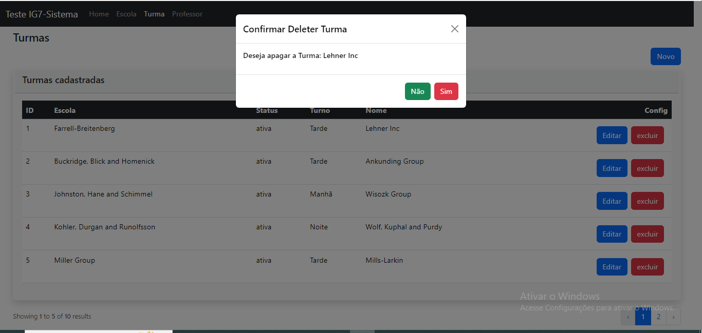
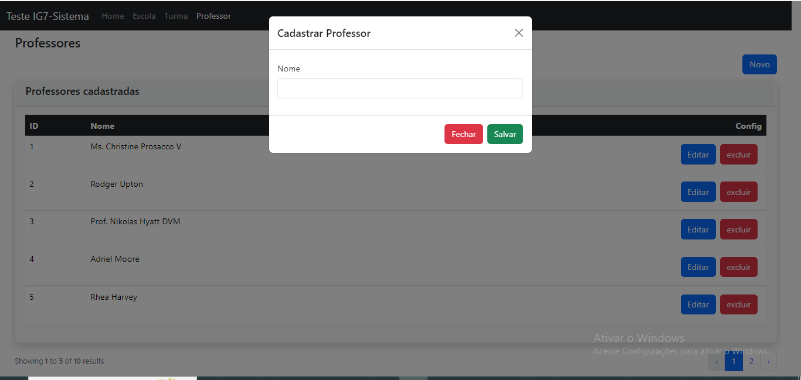
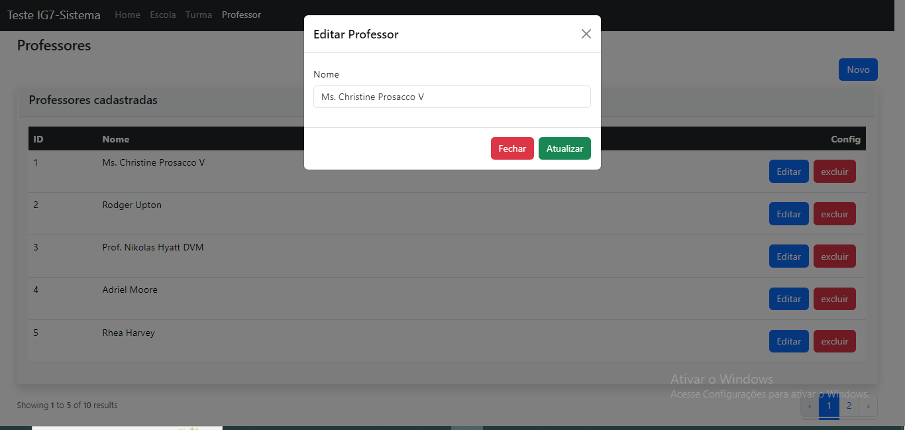
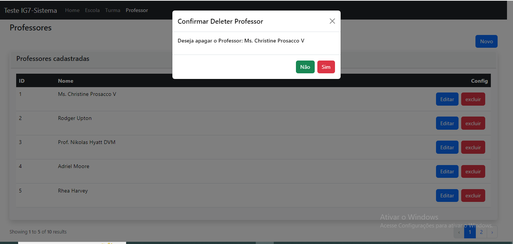

<p align="center"><a href="#" target="_blank"></a></p>


## Teste PHP IG7-Sistemas

Esse teste é uma aplicação em laravel para gerenciamento de algumas entidades de uma escola, e tem como objetivo avaliar os conhecimentos do candidato.

## 💻 Demostração da aplicação

Pagina Home:
<h1 align="center"> 
  
</h1>

Pagina Escola com as modais de adição, edição e exclusão:
<h1 align="center">
  
</h1>

<h1 align="center">
  
</h1>


<h1 align="center">
  
</h1>

Pagina Turma com as modais de adição, edição e exclusão:
<h1 align="center">
  
</h1>

<h1 align="center">
  
</h1>


<h1 align="center">
  
</h1>


Pagina Professor com as modais de adição, edição e exclusão:
<h1 align="center">
  
</h1>

<h1 align="center">
  
</h1>


<h1 align="center">
  
</h1>

## 🚀 Começando

Para iniciar o projeto sigua as instruções destacadas logo abaixo para não ter problema ao executar.

### 📋 Pré-requisitos

Você precisa ter em sua marquina as seguintes tecnologias:

* PHP - Linguagem de programação usada no desenvolvimento

* NODEJS - Platarfome V8 para executar javascript fora do navegador

* MYSQL - Banco de dados relacional

* COMPOSER - Gerenciar de dependência de PHP

### 🔧 Instalação

Faça um clone do projeto

```
git clone https://github.com/Nathan-rs/teste_ig7.git
```

Logo em seguida baixe as dependências via composer e via npm

Dentro da pasta teste_ig7 execute respectivamente

```
composer install
```

```
npm install
```

Após finalizar a instalação de cada dependência, precisa criar um arquivo .env e colocar as configurações do banco MYSQL

Exemplo:

```
DB_CONNECTION=mysql
DB_HOST=127.0.0.1
DB_PORT=3306
DB_DATABASE=laravel
DB_USERNAME=root
DB_PASSWORD=root
```

Configurado o arquivo .env precisa gerar um chave para pode acessar a aplicação. Execute o comando

```
php artisan key:generate
```

Execute as migrações no banco de dados:

```
php artisan migrate
```

Caso queira popular o banco. Use a seeder para isso:

Seeder Escola
```
php artisan db:seed --class=EscolaSeeder
```

Seeder Professor
```
php artisan db:seed --class=ProfessorSeeder
```

Seeder Turma
```
php artisan db:seed --class=TurmaSeeder
```

Aguarde a aplicação carregar os estilos do Bootstrap 5 e pronto.


## ✒️ Autore

Esse projeto foi desenvolvido por:
* Natã Ramos da Silva - Desenvolvedor web


---
⌨️ 🚀 por [Natã Ramos da Silva](https://github.com/Nathan-rs) 😊